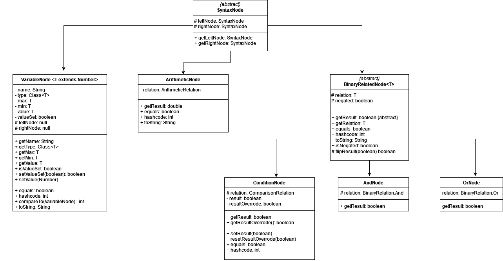

# How to install & Run the Project

I have develop all of these in IntelliJ. This is a maven project which I have tried running `mvn test` and it did
managed to run all of my tests. I have also tested running everything on the IntelliJ in the diamond machine.  

# Assumptions

I have assumed that the imaginary parser will generate the branch predicate into one root node that has the type
of `BinaryRelatedNode`. All of the root nodes for the subjects under tests are in the `ParsedExamples.java`. It is
assumed that node are generated correctly in a similar way like the ones in `ParsedExamples.java`.  
I have also assumed that there will be a instrumented version of the program of the subjects under tests that is
constructed in a way like `generateTestSuite/instrumentedExamples/Triangle.java` that one branch predicate correspond to
one method that will return true/false for the overall branch predicate result. It will also take in
a `HashSet<Integer>` that record the branches that the given input has covered. The last assumption on these
instrumented method is that the order of input parameters are ordered alphabetically.    

# Entry Point of this assignment

This entire package only have one main method which is in the `EntryPoint.java`. It has different static method that
will contruct the test requirements and instruct the generation of test cases for different subjects.    

# Data Structure for the branch predicate

The data structure for the branch predicate is something similar to a "Syntax Tree". I hava taken inspirations from the
abstract syntax tree from the C# side of the Roslyn (.NET Compiler Platform) purely because of my previous experience
with Roslyn. The overall data structure can be described by the following not strictly constructed UML graph.

The NOT relation is represented by the negated field in the `BinaryRelatedNode`

# Part 1 of the assignment

The code for this part are mostly in `TestRequirements.java`. It relies some functions in other helper class but the
functionalities for generating the restricted & correlated MCDC and elminating equivalent conditions are mostly in this
file.  

The output type of this part will be `TestRequirements` which contains the information for the restricted & correlated
MCDC and all the information needed for part 2 of the assignment.  
The `print` statements in the `EntryPoint.java` shows the information that I think it's quite important for this part of
the assignment.
  

# Part 2 of the assignment

The code for this part are mostly in the `generatedTestSuite` package.  

## `instrumentedExample` folder

This folder consist of the maually instrumented version of the subject under tests. I have used the `Triangle`
, `Calendar` from the lab as a subject for testing. For these instrumented version, they have a coveredBranch set to
show that which branch is being covered and can be used for the generated Unit test.  

## Generating Test Suite

The "root" class for this part of the assignment is `TestSuite.java`. It takes in a `TestRequirements` object and has
one public method `writeToFile` that will write all of the testcases corresponds to the restricted & correlated MCDC of
the input `TestRequirement` into the filepath specified in the input parameters of the constructor.  

There are two type of test cases that can be generated, `ParameterizedTestCase` and `TestCaseWithCoverBranch`. The
program will decided which one to generate based on the `generateCoverBranchField` field in `TestSuite`. 

### ParameterizedTestCase

`ParameterizedTestCase` will only generate tests that assert if the overall branch predicate (the boolean returned by
the instrumented method) is the same as the expected branch predicate result. The examples of these generated tests are
test files that don't have "WithCoverBranch" in their filename in the `test\generatedTestCases`  

### TestCaseWithCoverBranch

`TestCaseWithCoverBranch` will generate an addition field for the `expectedCoveredBranches` for the input of the JUnit
test. **This type of tests requires the input from the developers to see which branch is expected to be covered for that
particular test requirment.** The examples of these generated tests are appeneded with "WithCoverBranch" in
the `test\generatedTestCases` folder. In these examples, I have added "the input from the developer" (the values
for `expectedCoveredBranches`) 

## Input values generated for the test cases

The input values are generated mostly on random. The code correspons to this part are in `NumberValuesForInputs` class.
For most input in the example of the generated classes, there is a bound set on each variables which is definied in
the `VariableNode` constructor. If there is no bound set for a variable, the bound of it will simply be the min & max
value of the input type.

# Test Package

This folder consists of tests in two categories.  

## Generated Tests (`generatedTestCases` Package)

These are the test cases automatically generated by the program for part 2 of the assignment. The code that instruct the
creation of these tests are in `src/main/java/uk/ac/shef/com3529/assignment/EntryPoint.java`.  
More details of these tests are in `src/main/java/uk/ac/shef/com3529/assignment/Readme.md`.

## Rest of the tests

Tests outside of `generatedTestCases` are unit tests for the code. At the beginning of this assignment, I have used a
test-driven development approach to develop the software. The aim of them are more on sanity check on complicated
functionalities instead of following strictly on testing every single line of code. For code/classes not covered by the
unit tests, they are being tested manaually.